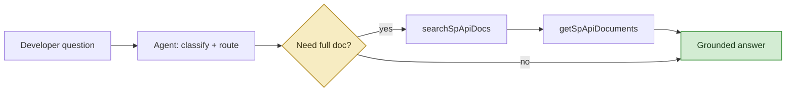
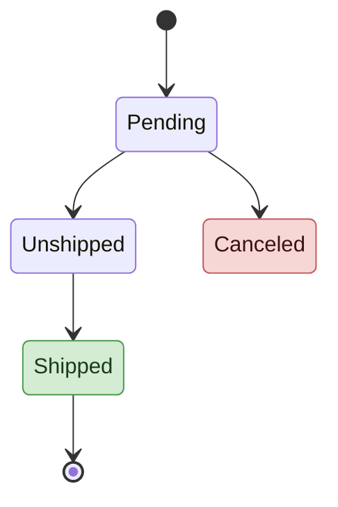
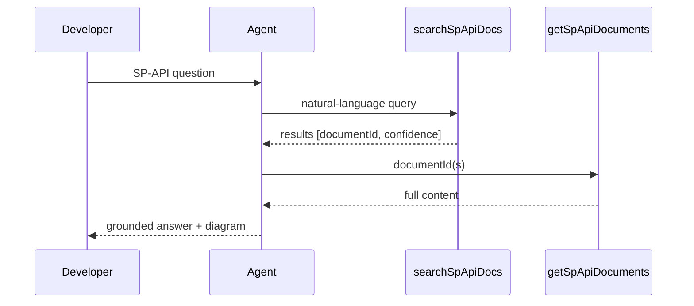

# Design, Visualization, and Code

How the skill turns SP-API questions into visuals, design proposals, and working code,
always grounded in retrieved documentation.

## Visualization playbook (every response, rendered inline by the client)

The client renders ```mermaid blocks, tables, and code inline. **Every turn pairs the
text answer with at least one rendered visual.** Pick the visual that fits the answer:

| Answer is about... | Visual to render |
|--------------------|------------------|
| An API call flow / "how X works" | mermaid **sequence** (client <-> SP-API calls) or **flowchart** |
| A status lifecycle (order, shipment, feed, report) | mermaid **state** diagram of documented transitions |
| Choosing between APIs / a comparison | a **decision/comparison table** (+ a small flow if a sequence is implied) |
| A data model / schema | mermaid **ER** or **class** diagram, or a highlighted-field table |
| A factual lookup | a compact **table** or a 2-3 node flow, still show something |
| A full design / brainstorm | the **proposal artifact** below |

Rule: **diagrams are built only from what the docs state.** Never add a state, transition,
parameter, or connection that isn't in retrieved content. An underspecified diagram beats a
speculative one. Cite the docs the diagram is based on.

## Make the diagram clean: minimal, accent-only styling (still fully inline)

Diagrams read best when they are **mostly clean with a few meaningful accents**, not painted
box-by-box. So **leave ordinary nodes at the default style** and add a soft accent color **only
to the nodes that carry special meaning**: decision/branch nodes, success/end states, and
error states. Everything stays inside the same fenced ```mermaid block (the client renders
it live); nothing is fetched or rendered externally.

**The rule of thumb: default nodes + up to three accent colors.** A plain, well-laid-out
diagram with a couple of colored highlights looks far cleaner and more consistent than one
where every box is a different color. **Never** use solid, saturated dark fills with white
text, that heavy look is exactly what we avoid.

Use these three soft accent classes, and only these:

- **`decision`**, the `{diamond}` branch/question nodes, a pale gold.
- **`done`**, a success / happy-path end state, a pale green.
- **`error`**, a failure / cancel / not-found state, a pale red. **Reserve red for that
  meaning only.**

Leave every other node (callers, ordinary steps, API calls) **unstyled**, the default light
node already looks clean and consistent. Keep text labels descriptive so color only ever
*reinforces* meaning, never carries it alone.

### How to apply it: `classDef` + `class` (flowchart, state, ER, class)
Define the accent classes once at the **end** of the block, then tag only the special nodes.
Leave everything else alone:


Only `Q` (the decision) and `Ans` (the end state) are colored; the rest stay default and clean.

### Example: order lifecycle as a documented state diagram
`stateDiagram-v2` takes the same `classDef` + `class` pattern. Color only the end states so the
eye lands on them; leave the in-flight states default:

(Only include the states/transitions the retrieved Orders docs actually define.)

### Sequence diagrams: leave them plain
`sequenceDiagram` doesn't take `classDef`. Just write it plain, a clean default sequence
diagram is exactly the look we want, and it renders reliably:


### Rules for styling (so it stays clean, accessible, and grounded)
- **Style is presentation, never content.** Coloring a node changes nothing about *what the
  docs say*, the grounding rule still governs every box, arrow, and state.
- **Default nodes + accents only.** Color just the decision, done, and error nodes; leave the
  rest at the default style. Never a different color per box, never a rainbow.
- **Soft accents only.** Use the three pale accent fills above. If a fill looks bold/saturated
  or needs white text, it is too dark.
- **Reserve pale red for error / cancel / not-found**, never for an ordinary step.
- **Keep it inline.** Everything above lives in the ```mermaid block. The client
  auto-renders a well-formed mermaid block as a diagram, do not switch to images or external
  renderers.

### Do-not-break rules (a styled block that fails to parse falls back to raw text)
The client renders a mermaid block **only if it parses cleanly**. One syntax error and it
shows the raw code instead of the diagram. Avoid these failure modes:
- **Give classes plain descriptive names** (`decision`, `done`, `error`). **Never** name a
  class `call`, `click`, `end`, `class`, `graph`, `state`, `default`, `link`, or `href`.
  These are **reserved words** and cause a hard parse error. If you need "the API call" node,
  name the class `apicall`, not `call`.
- **Hex colors are exactly 6 digits** (`#f7ecc2`), never 3-digit (`#abc`) and never 8-digit
  with alpha (`#01634899` is invalid and will break the render). No `rgba()`.
- **Put `classDef` lines and `class` assignments at the very end**, after all nodes/edges.
- **When in doubt, ship the plain unstyled diagram**, a clean default diagram is the target
  look anyway, and it always renders. Add accents only when the block is otherwise valid.

## The brainstorming / design-proposal artifact

When the developer is exploring an idea or asks for a design, produce **one self-contained
proposal artifact** (the client renders it live and can update it as they iterate):

1. **Problem / goal**, one short paragraph in the developer's own terms.
2. **Architecture diagram**, mermaid graph of the proposed integration (their system <->
   SP-API <-> notifications/reports).
3. **Sequence / workflow diagram**, the API call flow using **real operationIds** retrieved
   via `knowledgeTools_getSpApiOperation`.
4. **Decision table**, APIs / notifications / reports chosen, each with *why* (grounded in
   the use-case docs).
5. **Optional charts**, e.g. rollout phasing, or a rate-limit/quota view, where the docs
   provide the numbers.
6. **Sources**, the exact docs the design is grounded in.

**Iterate on the same artifact** as the developer refines ("what if we add returns?") so the
design visibly evolves. Keep everything grounded, every box, arrow, and row traces to a
retrieved doc.

## Idea -> code

1. **Search the official SDK tutorial first:** `"Tutorial: Automate your SP-API Calls using a
   prebuilt <language> SDK"`. Supported languages: **C#, Java, JavaScript, PHP, Python**. Use
   the developer's stated language; otherwise **default to JavaScript**.
2. Only hand-write custom HTTP/REST when no official SDK covers the use case.
3. Base all code on retrieved documentation. Adapt for correctness (imports, syntax) but
   **never invent** endpoints, parameters, or auth patterns not shown in the docs.
4. Include auth/setup, error handling, and clear comments; favor completeness over brevity.
5. Pair the code with the workflow diagram so the developer sees flow + implementation.

## Canonical official SP-API resources (cite when they add value)
- Developer Documentation: https://developer-docs.amazon.com/sp-api/
- Sample solutions (use cases): https://github.com/amzn/selling-partner-api-samples/tree/main/use-cases
- Schema / model repos: https://github.com/amzn/selling-partner-api-models
- Postman collections: https://www.postman.com/amazon-selling-partner-api/sp-api/overview
- SP-API University (video): https://www.youtube.com/@amazon-sp-api

Prefer the knowledge-base content (via the tools) as the primary source; use these official
links as supplementary "learn more" references, always as **descriptive** links.
