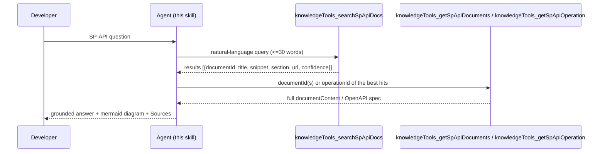

# Tool Reference: SP-API Knowledge tools

The skill orchestrates four **read-only** tools exposed through the Amazon Selling Partner Connector, backed by
`SPAPIKnowledgeToolsMCP` (Kendra search index + DynamoDB document store, pinned to the active
knowledge-base version).

## How to invoke (via the gateway `call_tool` meta-tool)

The gateway does not expose these four tools as top-level MCP tools you call by name. You
invoke each one through the gateway's `call_tool` meta-tool, passing the tool name and its
arguments. If `search_tool` / `get_tool_schema` are available, use them to confirm the exact
name and input schema first; otherwise call directly by name.

Examples (the arguments object matches each tool's input schema):

```json
// search
{ "name": "knowledgeTools_searchSpApiDocs",
  "arguments": { "query": "how do I subscribe to order notifications", "maxResults": 5 } }

// fetch full docs by the documentIds search returned
{ "name": "knowledgeTools_getSpApiDocuments",
  "arguments": { "documentIds": ["<id1>", "<id2>"] } }

// browse a section
{ "name": "knowledgeTools_browseSpApiSection",
  "arguments": { "section": "Orders API" } }

// get a specific operation's OpenAPI spec
{ "name": "knowledgeTools_getSpApiOperation",
  "arguments": { "operationId": "getOrders" } }
```

Everywhere below, a reference to a `knowledgeTools_*` tool means "invoke it through
`call_tool` with that `name` and the arguments shown."

## The two-step contract (search -> fetch)

Search returns lightweight results for triage; a second call fetches full content. This keeps
responses fast and grounded.



## Tools

### `knowledgeTools_searchSpApiDocs`
- **Input:** a natural-language query (a well-formed question, not keyword fragments), under
  ~30 words. Optionally a section/type filter and pagination token.
- **Returns:** ranked results, each with `documentId`, `title`, `snippet`, `section`, `url`,
  and a `confidence` level (VERY_HIGH / HIGH / MEDIUM / LOW). Version-scoped to the active
  KB version automatically.
- **Use it as the entry point** for almost every question. The `documentId` it returns is
  what you pass to `knowledgeTools_getSpApiDocuments`.

### `knowledgeTools_getSpApiDocuments`
- **Input:** one or more `documentId`s (the `documentId` from search results, this equals
  the store's partition key, so it resolves directly).
- **Returns:** full document content (title, content, section, url, type, version) for each;
  any ids that don't resolve come back in `notFoundIds`.
- **Use it** to read the actual documentation behind the snippets before you answer.

### `knowledgeTools_browseSpApiSection`
- **Input:** a `section` name, optional `maxResults` + `nextToken`.
- **Returns:** the documents in that section as summaries, in display order, with a
  `nextToken` when more pages exist.
- **Use it** for onboarding / "getting started" / "what's in this area" / directory-style
  questions, browse the section to orient before fetching specific docs. Prefer this over an
  initial search for onboarding, registration, changelog, and directory lookups.

### `knowledgeTools_getSpApiOperation`
- **Input:** an `operationId` (e.g. `getOrders`, `createFeed`, `searchCatalogItems`).
- **Returns:** the full OpenAPI specification fragment for that operation (path, verb,
  parameters, request/response schema), plus title and url. Filtered to the active version.
- **Use it** when the developer needs the exact API contract, or when a design/code step
  names specific operations.

## Behaviors to know
- **Confidence is the trust signal.** Build the answer's backbone from VERY_HIGH / HIGH hits;
  treat MEDIUM / LOW as leads to confirm, not facts.
- **Version is implicit and current-only.** Retrieval is pinned to the active knowledge-base
  version; do not try to request historical versions. Surface deprecation/version notes when
  the docs state them.
- **Empty results are normal.** A search may return nothing for a bad phrasing, reformulate
  (see [query-craft.md](query-craft.md)) rather than concluding the topic doesn't exist.
- **Results are capped** (roughly the top results by confidence); spend your query budget on
  distinct phrasings, not on paging deeper.
